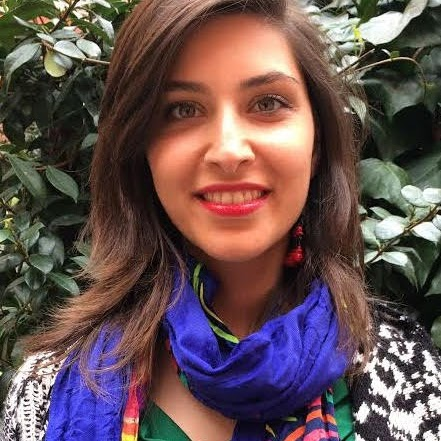
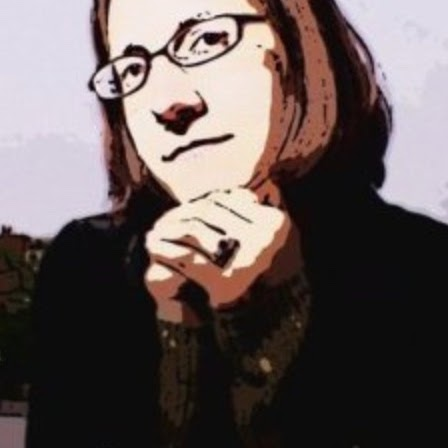

:::: {layout="[30,60,10]"}
::: {#first-column}

:::

::: {#second-column}
#### Valeria de Paiva

**Title: Logic, Proof, and Community: The Revolution Beneath the Revolution**

Abstract: Frank Quinn has argued that mathematics underwent an invisible revolution in the early twentieth century: mathematicians fundamentally changed their understanding of proof and rigour, giving rise to modern logic, proof theory, and the foundations of computer science — largely without noticing they had done so.

This talk argues that the revolution did not stop there. The Curry–Howard correspondence, developed through type theory, linear logic, and categorical semantics, transformed proofs from certificates of truth into structured mathematical objects with computational content. Category theory provided the organisational language. This revolution of structure continues to unfold in proof assistants, homotopy type theory, and formal verification — and is now being stress-tested by AI at a scale nobody anticipated.

The talk closes with a reflection on a different but equally invisible infrastructure: the social structures that sustain mathematical work. Drawing on ten years of data from the Women in Logic workshop series, I consider how visibility and community shape the development of a field.
:::
::::

:::: {layout="[30,60,10]"}
::: {#first-column}

:::

::: {#second-column}
#### Raheleh Jalali

**Title: The Cost of Restricting Structural Rules**

Abstract: Proving non-trivial lower bounds on proof size in the classical sequent calculus remains a longstanding open problem in proof complexity. In this work, we revisit this problem through the lens of substructural and linear logics. By considering calculi that restrict contraction or weakening, we obtain systems in which derivations are subject to resource-sensitive constraints. Within these frameworks, we exhibit formulas that, while admitting short classical proofs, require substantially larger derivations. These results provide a proof-theoretic explanation of why classical systems are difficult to analyze: their efficiency stems from the interaction of structural rules, a feature that becomes visible only when examined against substructural baselines.
:::
::::

:::: {layout="[30,60,10]"}
::: {#first-column}

:::

::: {#second-column}
#### Sara Uckelman

**Title TBA**

Abstract TBA
:::
::::

